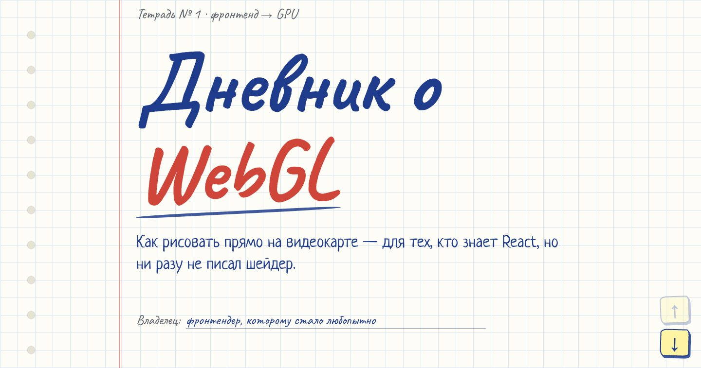
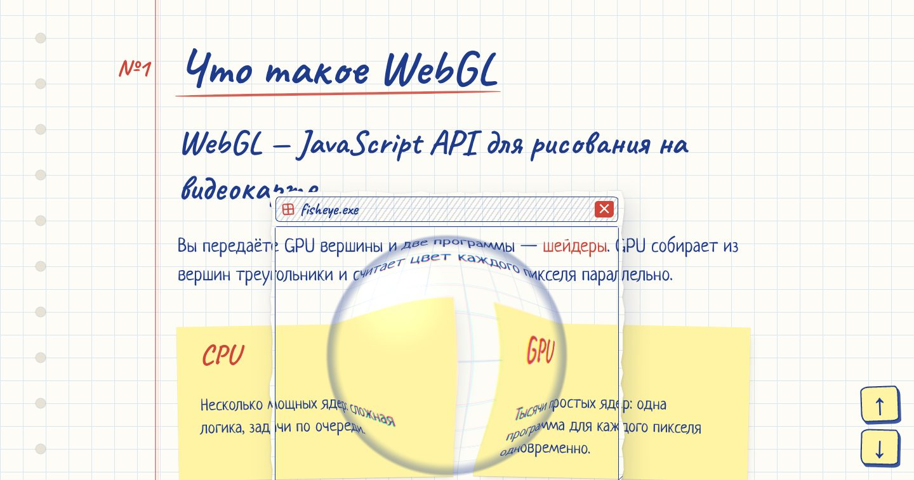
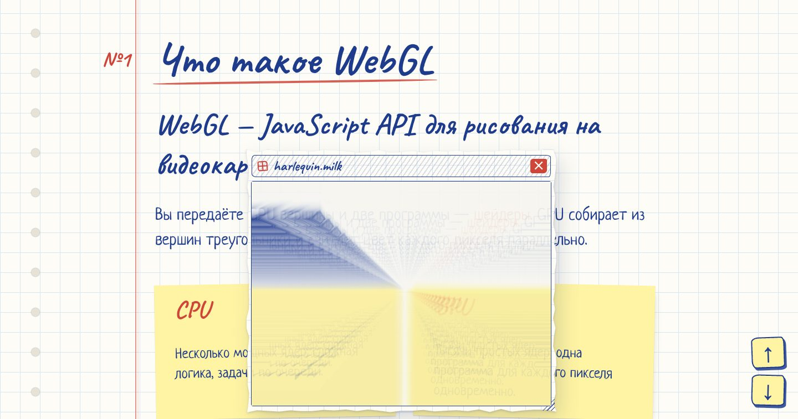
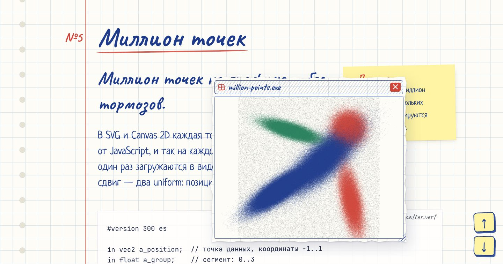

<div align="center">

# Дневник о WebGL

**Презентация для фронтенд-разработчиков в виде тетради в клетку:<br>что такое WebGL, как устроены шейдеры и как применить их к самой странице.**

[](https://github.com/npb73/webgl_demo/actions/workflows/deploy.yml)


### [→ Открыть сайт](https://npb73.github.io/webgl_demo/)



</div>

## О чём это

Десять слайдов-записей: от «WebGL — JavaScript API для рисования на видеокарте» до шейдеров, которые искажают саму страницу. Короткий текст, аналогии из привычного фронтенда и живые демо в бумажных окнах. Окна таскаются за заголовок, меняют размер и пропускают клики сквозь себя.

Листать — стрелками ↑ ↓ в правом нижнем углу или клавишами <kbd>PageUp</kbd> / <kbd>PageDown</kbd> (их же отправляют пульты для презентаций).

## Демо

<table>
  <tr>
    <td width="50%"></td>
    <td width="50%"></td>
  </tr>
  <tr>
    <td><b>Шейдеры поверх страницы.</b> Линза, разбитое стекло, рябь и огонь искажают всё, что лежит под окном, — текст, стикеры и другие окна.</td>
    <td><b>Milkdrop без музыки.</b> Шесть пресетов визуализатора Winamp: от каждого берётся только поле движения, и по нему течёт сама страница.</td>
  </tr>
  <tr>
    <td></td>
    <td valign="top">
      <b>Миллион точек.</b> Точечный график, который можно взять в продукт: данные один раз лежат в видеопамяти, зум и сдвиг — два uniform. Колесо — зум к курсору, перетаскивание — сдвиг, двойной клик — сброс.
      <br><br>
      <b>Первый шейдер.</b> Десять строк GLSL: цвет пикселя — косинус от координаты и времени.
    </td>
  </tr>
</table>

## Включите флаг в Chrome

Шейдеры, искажающие страницу, используют экспериментальный API [HTML-in-Canvas](https://github.com/WICG/html-in-canvas): браузер отрисовывает HTML внутри `<canvas>` в текстуру.

1. Откройте `chrome://flags/#canvas-draw-element` и включите флаг.
2. Перезапустите браузер.

Без флага сайт работает как обычная страница: читаются все слайды, работают первый шейдер и график, а окна-эффекты показывают подсказку про флаг.

## Как это устроено

**Вся страница — внутри одного canvas.** С флагом страница становится `drawable`-потомком `<canvas>`, прибитого к экрану. Браузер верстает её как обычно, а на экран её выводит WebGL: на каждом кадре в текстуру попадает видимая часть страницы. Клики, ховеры и выделение текста работают, потому что браузеру сообщают, где элемент нарисован.

**Окна — слои той же сцены.** Рамку окна браузер рисует в текстуру один раз, а положение и содержимое задаёт сцена. Перетаскивание ничего не перерисовывает в DOM — меняется одна матрица. Шейдер окна получает подложку: всё, что нарисовано под окном.

**Milkdrop без своих цветов.** Пресеты из коллекции [butterchurn-presets](https://github.com/jberg/butterchurn-presets) считает движок [butterchurn](https://github.com/jberg/butterchurn), тот же, что в [Webamp](https://github.com/captbaritone/webamp). Он работает в крошечном скрытом canvas, а сцена забирает из него только сетку «откуда брать прошлый кадр». Каждый кадр окна — прошлый кадр, сдвинутый по этой сетке, плюс 7% свежей страницы. Вместо музыки — случайный сигнал в формате звука.

**Шейдеры лежат в .wasm.** GLSL-исходники из [`shaders/`](shaders/) упаковываются в WebAssembly-модули скриптом [`scripts/build-shader-wasm.mjs`](scripts/build-shader-wasm.mjs). В браузере JS читает строки из памяти модуля и компилирует их как обычный GLSL.

## Запуск

```bash
npm install
npm run dev        # http://localhost:3000
```

| Команда | Что делает |
| --- | --- |
| `npm run dev` | dev-сервер; перед стартом пересобирает шейдеры |
| `npm run build` | статическая сборка в `out/` |
| `npm run shaders` | только упаковать `shaders/*.vert` + `*.frag` в `public/shaders/*.wasm` |
| `npm run lint` | ESLint |

## Структура

```
shaders/                 GLSL: эффекты окон, сцена, график, Milkdrop
scripts/                 упаковка шейдеров в .wasm
app/
  page.tsx               слайды
  content/               тексты и данные слайдов
  components/
    Stage/               сцена: страница в canvas, окна, эффекты
    PaperWindow/         бумажное окно (DOM-режим и слой сцены)
    Milkdrop/            пресеты, поле движения, случайный «звук»
    Plot/                график на миллион точек
    SlideNav/            стрелки листания
  lib/webgl/             загрузка .wasm, компиляция шейдеров
docs/screenshots/        картинки для этого README
```

## Деплой

Каждый пуш в `main` собирает сайт и публикует его на GitHub Pages: [`.github/workflows/deploy.yml`](.github/workflows/deploy.yml). Сайт живёт в подпапке репозитория, поэтому сборка получает путь через `PAGES_BASE_PATH`. Локально переменная не нужна.

## Благодарности

- [butterchurn](https://github.com/jberg/butterchurn) и [butterchurn-presets](https://github.com/jberg/butterchurn-presets) (MIT), Jordan Berg — движок и пресеты Milkdrop.
- Авторы пресетов: Flexi, martin, Geiss, Krash, Illusion, Rovastar, bdrv, al shifter, suksma, Phat.
- [Webamp](https://github.com/captbaritone/webamp) — Winamp в браузере, откуда пришла идея.
- [WICG HTML-in-Canvas](https://github.com/WICG/html-in-canvas) — API, на котором держится вся сцена.
- Шрифты Caveat, Neucha и JetBrains Mono — Google Fonts.
